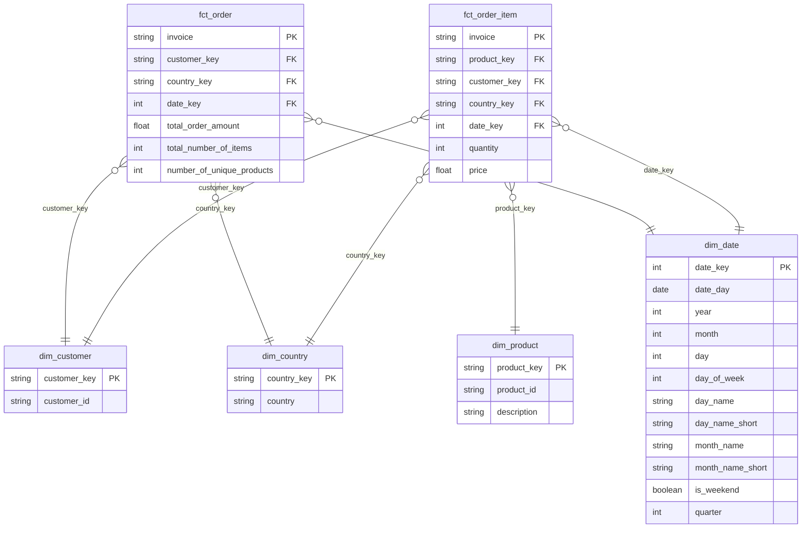

## Overview

This project showcases an end-to-end data pipeline using `SQL Server`, `python`, and `dbt` to transform raw invoice data into a Kimball dimensional model. The resulting data warehouse supports analytical reporting for the business users.

### Assumptions & Abnormalities

- `CustomerID` values should be integers. Any rows with text values (there are records with `CustomerID = 'TEST'`) are ignored

- Price values should not be `NULL`, they're filled with `0`s

- The country values for records with `country = 'Unspecified'` are converted to `NULL`

- There are 41 records with the same `invoice` values but different `invoice_dates`. With a deep dive into the difference in minutes, it is seen that the difference is negligible because there is a maximum of 9 minutes between different `invoice_date` values for the same invoice

```sql
    select
      invoice,
      datediff(minute, min(invoice_date), max(invoice_date)) as diff_minutes
    from model.stg_raw__invoices
    group by invoice
    having count(distinct invoice_date) > 1
    order by diff_minutes desc
```

- There are 89 records with `country = 'U.K.'` and 485734 records with `country = 'United Kingdom'`. For consistency, `U.K.` values are converted to `'United Kingdom'`.

- For some invoices, there can be both `NULL` and valid countries at the same time. In such cases, `NULL` records can be replaced with the valid ones from the same partition (obtained from other rows of the same invoice by a `MAX` window function).

### Repository Structure

```
├── build
│   ├── database
│   ├── invoice-extract-load
│   └── invoice-transform
│
└── src
    ├── invoice-extract-load
    └── invoice-transform
```

### How to run the project?

By running `docker compose up` the services will run in the following order:

1. The SQL Server instance will be initiated and configured by `configure-db.sh` and `setup.sql`. The configuration simply creates a new database and a user both named `betsson` (as given by the `.env` file)
2. Once SQL Server service is in healthy state, `invoice-extract-load` pipeline will start. The pipeline will first read the csv from the provided url, then make some simple transformations and finally load the data to the table `betsson.raw.invoices`
3. After `invoice-extract-load` is finished successfully, `dbt` project named `invoice-transform` will be executed. The project aims to build the Kimball model with the listed tables:

```
- fct_order_item
- fct_order
- dim_product
- dim_customer
- dim_country
- dim_date
```

### Model Design



### Example Aggregations for Reporting

- Top Selling products per country

```sql
  with product_sales as (
    select
      country_key,
      product_key,
      count(distinct invoice) as number_of_orders
    from model.fct_order_item
    group by
      country_key, product_key
  ),

  top_sales_per_country as (
    select
      country_key,
      max(number_of_orders) as number_of_orders
    from product_sales
    group by country_key
  )

  select
    dc.country,
    dp.description as product,
    ps.number_of_orders
  from product_sales ps
  inner join top_sales_per_country tspc on tspc.country_key = ps.country_key and tspc.number_of_orders = ps.number_of_orders
  left join model.dim_country dc on dc.country_key = ps.country_key
  left join model.dim_product dp on dp.product_key = ps.product_key
  where dc.country <> '#N/A'
  order by number_of_orders desc
```

- Total number of orders per country

```sql
  select
    dc.country,
    count(1) as total_number_of_orders
  from model.fct_order fc
  left join model.dim_country dc on dc.country_key = fc.country_key
  group by dc.country
  order by count(1) desc
```

- Top Selling 5 products

```sql
  with product_sales as (
    select
      foi.product_key,
      count(distinct invoice) as number_of_orders
    from model.fct_order_item foi
    group by
        foi.product_key
  )

  select top 5
      dp.description as product,
      ps.number_of_orders
  from product_sales ps
  left join model.dim_product dp on ps.product_key = dp.product_key
  order by number_of_orders desc
```
